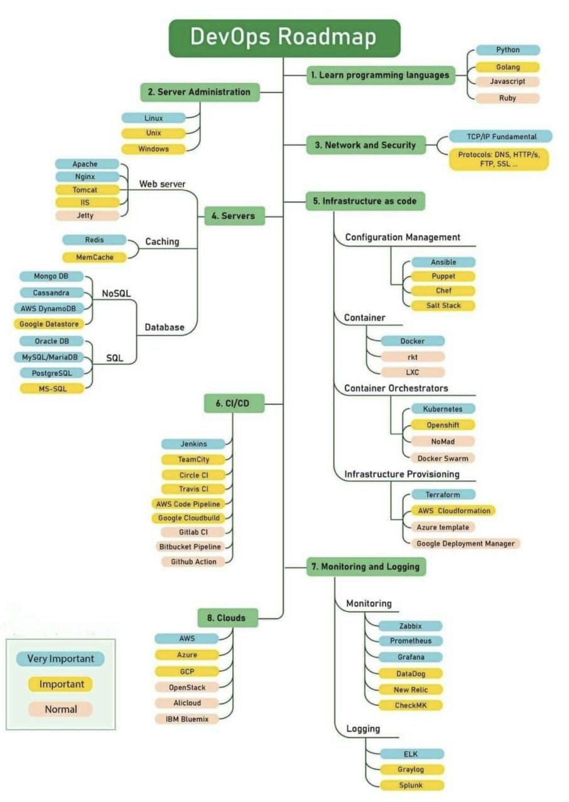

# The DevOps Roadmap
 

### Índice

* [__Learn Programming Languages__](/langs/README.md)
    - [__Python__](/langs/python/README.md)
    - [__GO__](/langs/go/README.md)
    - [__JavaScript__](/langs/js/README.md)
    - [__Ruby__](/langs/ruby/README.md)

* [__Server Administration__](/admin/README.md)
    * [__Linux__](/admin/linux/README.md)
    * [__UNIX__](/admin/unix/README.md)
    * [__Windows__](/admin/windows/README.md)

* [__Network & Security__](/netsec/README.md)

* [__Servers__](/server/README.md)

* [__Infrastructure as Code__](/iac/README.md)
    - [__Configuration Management__](/iac/config/README.md)
        - [__Ansible__](/iac/config/ansible/README.md)
        - [__Chef__](/iac/config/chef/README.md)
        - [__Puppet__](/iac/config/puppet/README.md)
        - [__SaltStack__](/iac/config/saltstack/README.md)

    - [__Container__](/iac/container/README.md)
        - [__Docker__](/iac/container/docker/README.md)
        - [__LXC__](/iac/container/lxc/README.md)
        - [__rkt__](/iac/container/rkt/README.md)

    - [__Container Orchestrators__](/iac/orchestration/README.md)
        - [__Kubernetes__](/iac/orchestration/k8s/README.md)
        - [__OpenShift__](/iac/orchestration/openshift/README.md)
        - [__Nomad__](/iac/orchestration/nomad/README.md)
        - [__Swarm__](/iac/orchestration/swarm/README.md)

    - [__Infrastructure Provisioning__](/iac/provision/README.md)
        - [__Terraform__](/iac/provision/terraform/README.md)
        - [__AWS CloudFormation__](/iac/provision/aws_cloudformation/README.md)
        - [__Azure Template__](/iac/provision/azu_template/README.md)
        - [__Google Deploy Manager__](/iac/provision/gog_deploy_manager/README.md)

* [__CI/CD__](/cicd/README.md)
    - [__AWS Code Pipeline__](/cicd/aws_code_pipeline/README.md)
    - [__Bit Bucket__](/cicd/bitbucket/README.md)
    - [__CircleCI__](/cicd/circleci/README.md)
    - [__Cloud Build__](/cicd/cloudbuild/README.md)
    - [__Github Actions__](/cicd/gh_actions/README.md)
    - [__Gitlab__](/cicd/gitlab/README.md)
    - [__Jenkins__](/cicd/jenkins/README.md)
    - [__TeamCity__](/cicd/teamcity/README.md)
    - [__Travis__](/cicd/travis/README.md)

* [__Logging & Monitoring__](/logmon/README.md)

* [__Clouds__](/cloud/README.md)

 

 

[__The DevOps Roadmap__](#main)
